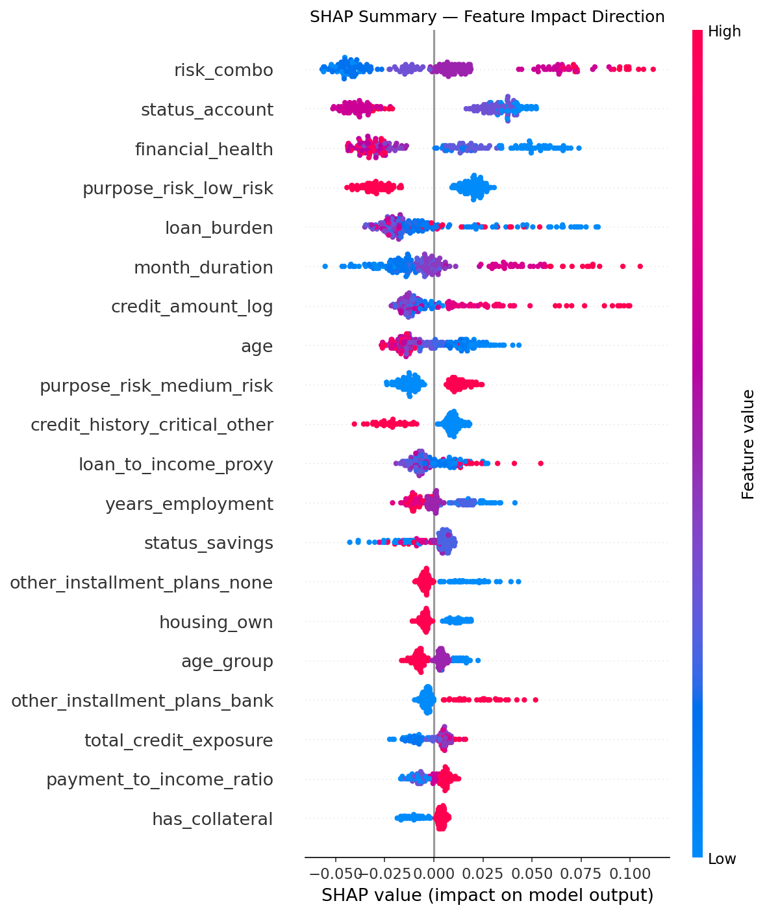
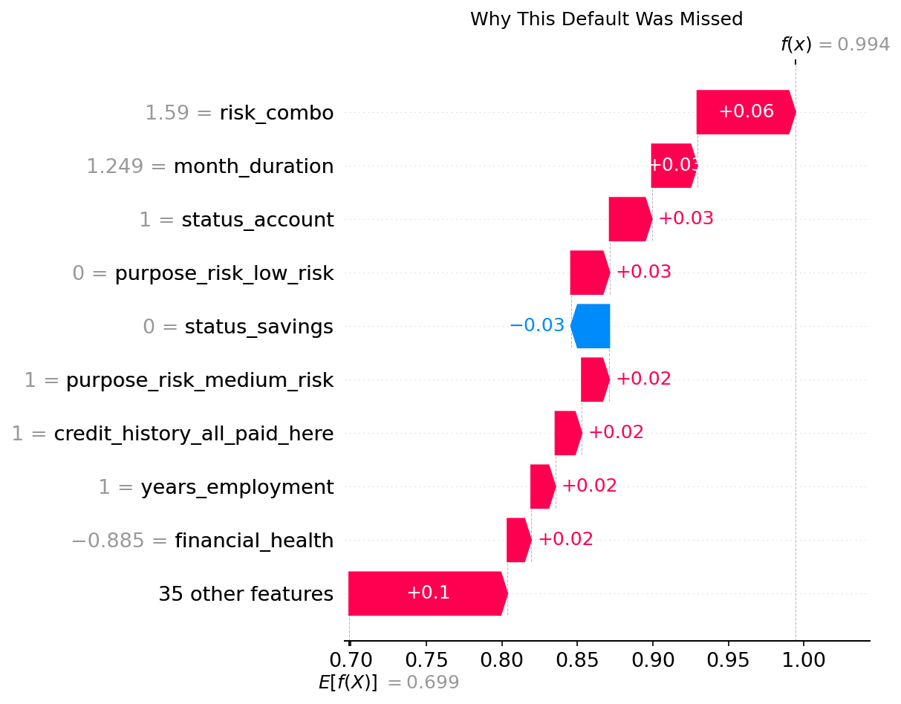

# Credit Default Prediction with Interpretability

Predict whether a borrower is likely to default on a loan using a classic credit-risk dataset, with a strong focus on model transparency and business-friendly interpretation.

This project uses the **Home Credit Default Risk** dataset from Kaggle, a real-world credit scoring benchmark with multiple tables and borrower-level features. The workflow includes train/test splitting, feature engineering, preprocessing, regularized logistic regression, and interpretability analysis with SHAP and coefficient-based insights.

## Project Overview

Credit default prediction is a high-impact classification problem in lending and risk management.  
Beyond raw prediction performance, this project emphasizes explainability so the results can be translated into actionable business decisions.

### Goals

- Build a reliable credit default classification pipeline.
- Engineer useful borrower and loan features.
- Train baseline and interpretable models.
- Analyze predictions using SHAP values, feature importance, and model coefficients.
- Translate model outputs into business metrics such as risk segments, approval thresholds, and default likelihood.

## Dataset

The project is based on the **Home Credit Default Risk** for now I'm using **German Credit Data** dataset, which includes borrower application data and related credit history tables.


## Workflow

1. Load and inspect the dataset.
2. Perform exploratory data analysis.
3. Engineer features from application and historical credit data.
4. Build preprocessing pipelines for missing values, encoding, and scaling.
5. Train models such as Logistic Regression with regularization.
6. Compare performance against other baseline classifiers.
7. Explain predictions using SHAP and feature importance.
8. Translate model output into practical lending decisions.

## Models

Planned models for comparison:

- Logistic Regression
- Naive Bayes
- Decision Tree
- Random Forest

The main focus is on **Logistic Regression** because it offers strong interpretability when combined with regularization and coefficient analysis.

## Interpretability

This project prioritizes explainability at every stage.

Planned interpretability methods:

- SHAP values for local and global explanations.
- Feature importance rankings.
- Logistic regression coefficient analysis.
- Business metric translation for credit decisioning.

Example business questions this project can answer:

- Which features most increase default risk?
- How does a change in income or credit history affect predictions?
- What threshold should be used to flag high-risk borrowers?
- Which borrower segments are safest for approval?

---

## Results

| Model               | AUC    | FN | FP |
|---------------------|--------|----|----|
| Logistic Regression | 0.760  | 18 | 32 |
| Naive Bayes         | 0.718  | 35 | 26 |
| Decision Tree       | 0.724  | 19 | 34 |
| Random Forest       | 0.801  |  7 | 41 |
| Gradient Boosting   | 0.784  | 17 | 30 |
| SVM                 | 0.786  | 13 | 38 |

**Best model: Random Forest (tuned)**
- AUC after tuning : 0.7903
- Threshold        : 0.45
- False Negatives  : 3  (missed defaults)
- False Positives  : 47 (false alarms)

Threshold set to 0.45 rather than default 0.50 - each missed default
costs the full loan principal, while a false rejection costs only
interest revenue. Reducing FN from 6 to 3 at the cost of 5 additional
false rejections is the better business tradeoff.

---

## Business Decision Rules

| Risk Band              | Threshold        | Action        |
|------------------------|------------------|---------------|
| Low risk               | P(default) < 0.35  | Auto-approve  |
| Medium risk            | P(default) 0.35–0.45 | Manual review |
| High risk              | P(default) > 0.45  | Auto-reject   |

---

## Interpretability

Feature importance and SHAP values explain both global model behaviour
and individual predictions.

**Global - what drives default risk overall:**



**Local - why a specific applicant was flagged:**



---

## Repository Structure

```bash

credit-default-prediction/
├── data/
│   ├── raw/                
│   └── processed/          
├── Notebook/
│   └── EDA_01.ipynb         
├── src/
│   ├── data_loader.py
│   ├── preprocessing.py
│   ├── models/
│   │   └── train_model.py 
│   └── tunning.py
├── evaluation.py
├── train.py
├── tune.py
├── predict.py
├── config.yaml
├── requirements.txt
└── README.md
```

## Status

🔄 In Progress

- [x] EDA - class balance, distributions, correlation analysis
- [x] Feature engineering
- [x] Preprocessing pipeline
- [x] Model training - Logistic Regression, Naive Bayes, Decision Tree, Random Forest
- [x] Interpretability - feature importance, coefficient analysis
- [x] Evaluation - comparison across models

## Metrics

Planned evaluation metrics:

- ROC-AUC
- Accuracy
- Precision
- Recall
- F1-score
- Confusion matrix

For imbalanced credit-risk problems, ROC-AUC and recall are often especially useful for assessing default detection quality.

## Workflow

```bash
python train.py       # trains 6 models, saves .pkl files
python tune.py        # tunes Random Forest + Gradient Boosting
python evaluate.py    # generates all plots + SHAP explanations
python predict.py     # predict default risk for a new applicant
```

---

## Models

Six classifiers trained and compared:

- Logistic Regression
- Naive Bayes
- Decision Tree
- Random Forest  ← best performer
- Gradient Boosting
- SVM

Hyperparameter tuning via RandomizedSearchCV with StratifiedKFold (5 folds)
on Random Forest and Gradient Boosting.

Best Random Forest params:
`n_estimators=300, max_depth=7, min_samples_split=5, max_features=log2`

---

## Key Design Decisions

**Stratified split** —> preserves the 70/30 class ratio in both
train and test sets. Standard for imbalanced classification.

**Threshold = 0.45** —> tuned to minimize false negatives (missed
defaults). In credit lending, a missed default costs the full principal;
a false rejection costs only the interest revenue.

**No class_weight='balanced'** —> tested but increased FN significantly.
The 70/30 split already represents real-world default rates; forcing
balance distorted predictions toward the minority class.

**Normalization fit on train only** —> mu and sigma computed from
training set and applied to test set. Prevents data leakage.

## Setup

**Requirements**

```
pip install -r requirements.txt
```

**Environment**

Create a `.env` file in the project root:

**Run**

```bash
python train.py
python tune.py
python evaluate.py
```

open the notebooks in `notebooks/` to explore the data and model results step by step.

## Dependencies

- Python
- pandas
- numpy
- scikit-learn
- matplotlib
- seaborn
- shap

---

## Dataset

German Credit Data — 1000 borrowers, 20 original features.
Engineered to 32 features before dropping redundant columns.
Target: 1 = default (70%), 0 = no default (30%).

Source: UCI Machine Learning Repository

## License

MIT License

Copyright (c) 2026 Fallen

Permission is hereby granted, free of charge, to any person obtaining a copy
of this software and associated documentation files (the "Software"), to deal
in the Software without restriction, including without limitation the rights
to use, copy, modify, merge, publish, distribute, sublicense, and/or sell
copies of the Software, and to permit persons to whom the Software is
furnished to do so, subject to the following conditions:

The above copyright notice and this permission notice shall be included in all
copies or substantial portions of the Software.

THE SOFTWARE IS PROVIDED "AS IS", WITHOUT WARRANTY OF ANY KIND, EXPRESS OR
IMPLIED, INCLUDING BUT NOT LIMITED TO THE WARRANTIES OF MERCHANTABILITY,
FITNESS FOR A PARTICULAR PURPOSE AND NONINFRINGEMENT. IN NO EVENT SHALL THE
AUTHORS OR COPYRIGHT HOLDERS BE LIABLE FOR ANY CLAIM, DAMAGES OR OTHER
LIABILITY, WHETHER IN AN ACTION OF CONTRACT, TORT OR OTHERWISE, ARISING FROM,
OUT OF OR IN CONNECTION WITH THE SOFTWARE OR THE USE OR OTHER DEALINGS IN THE
SOFTWARE.

